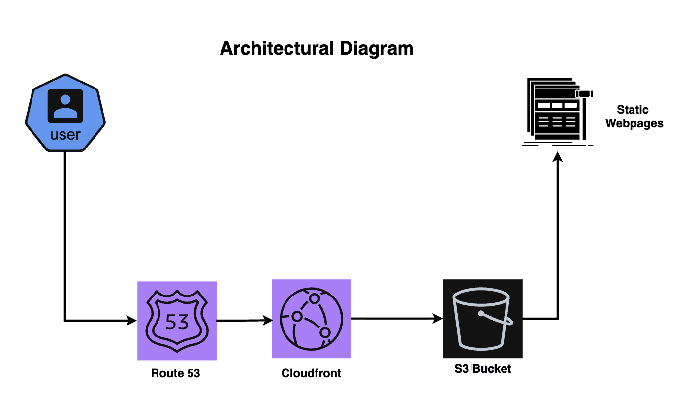

# Static Website Hosting using AWS S3 with Custom Domain

## Project Overview

This project demonstrates how a static website can be hosted on AWS using Amazon S3 and made accessible through a custom domain. The architecture incorporates additional AWS services such as Amazon CloudFront and AWS Route 53 whihc makes the website delivered globally with improved performance, scalability and maintaining a simple serverless hosting approach.

---

## What & Why S3

Amazon S3 (Simple Storage Service) is an object storage service that allows users to store and retrieve data from anywhere on the internet. Unlike traditional file systems or databases, S3 stores data as objects inside containers called buckets. Each object can be accessed through a URL when proper permissions are configured.

S3 is widely used for static website hosting because it provides:

- High durability  
- Massive scalability  
- Cost efficiency  
- Seamless integration with other AWS services  

---

## Static Hosting Feature on S3

Amazon S3 provides a built-in feature called **Static Website Hosting** that allows an S3 bucket to behave like a simple web server. Once enabled, the bucket can serve static files directly to users over the internet.

A typical static website hosted on S3 may include:

- HTML files  
- CSS stylesheets  
- JavaScript files  
- Images  
- Fonts  

After enabling static website hosting, AWS generates a website endpoint URL that users can access through their browser. This allows the content stored in the bucket to be served as a publicly accessible website.

---

## Configuring Domain Routing in AWS Route 53

The default S3 website endpoint contains a long AWS-generated domain name, which is not suitable for real-world websites. To provide a user-friendly domain name, I used AWS Route 53 for domain routing.

In this project, a dedicated hosted zone was created in Route 53 and the necessary DNS records were configured to map the custom domain to the S3 hosting endpoint. This setup allows visitors to access the website through the custom domain while Route 53 resolves the domain name and directs traffic to the appropriate AWS resource.

---

## The HTTPS Limitation in S3 Static Website Hosting

While Amazon S3 provides a simple and cost-effective way to host static websites, it introduces a limitation when secure connections are required. The built-in static website hosting feature serves content only over HTTP. Modern websites are expected to support HTTPS in order to provide encrypted communication between users and the website.

Because of this limitation, directly connecting a custom domain to an S3 static website endpoint can create challenges when users attempt to access the site using HTTPS.

---

## Resolving the HTTPS Limitation with Amazon CloudFront

To address the HTTP limitation and provide a secure browsing experience, I integrated Amazon CloudFront into the architecture. CloudFront, AWS’s Content Delivery Network (CDN), acts as an intermediary between users and the S3 bucket, enabling secure HTTPS connections.

When visitors access the website through the custom domain, CloudFront handles the encrypted HTTPS connection and retrieves the required content from the S3 bucket. In addition to enabling secure content delivery, CloudFront improves performance by distributing cached copies of the website through its global network of edge locations.

---

## Practical Use Case: Small Business Website

This hosting architecture is well suited for small businesses that require a simple online presence without maintaining complex infrastructure. For example, a local restaurant, photography portfolio, or consulting service website may only require static pages such as a homepage, service description, gallery, and contact information.

By hosting the website using S3 and CloudFront, businesses can deploy their website quickly while avoiding the need to manage servers or perform infrastructure maintenance. This approach provides reliable performance and scalability while keeping operational costs low.

---

## Architectural Diagram

---
